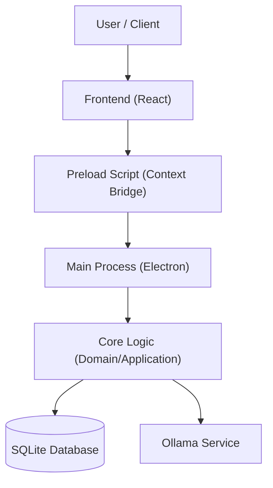

# promptflow


A professional desktop application for managing, organizing, and optimizing AI prompts with integrated semantic search and local LLM integration via Ollama.

## Description

PromptFlow is a robust management system designed specifically for power users who work extensively with Large Language Models (LLMs). It provides a structured environment to create, version-control, and organize prompt templates. 

The application bridges the gap between raw text prompts and production-ready workflows by offering features like automated metadata suggestion, AI-driven prompt improvement, and duplicate detection. By integrating directly with local inference engines via Ollama, PromptFlow ensures that your proprietary prompts remain private while still benefiting from advanced capabilities such as vector embeddings for semantic search across large libraries of content.

## Key Features

*   **Advanced Organization**: Manage prompts using a hierarchical category system, custom tags, and collections to keep workflows organized.
*   **Version Control**: Track changes over time with an internal versioning system that preserves historical iterations of your prompt logic.
*   **Semantic Search**: Utilize vector embeddings (via Ollama) to find relevant prompts based on meaning rather than just keyword matching.
*   **AI-Assisted Engineering**: 
    *   `Suggest Metadata`: Automatically generate tags and descriptions for new entries.
    *   `Improve Prompt`: Refine prompt clarity, detail level, or structure using selected models.
    *   `Generate Prompt`: Create high-quality prompts from simple requirements.
*   **Playground Environment**: A dedicated space to test multiple LLM responses side-by-side with real-time streaming support and execution logging.
*   **Local First Architecture**: Built on SQLite for reliable local storage, ensuring your data stays offline unless you choose otherwise.

## Technologies

The project is built using a modern desktop stack:

*   **Frameworks**: Electron (Desktop Shell), React (UI Layer).
*   **State Management**: Zustand for lightweight and perform able client-side state.
*   **Database**: SQLite via `better-sqlite3` for high-performance local storage.
*   **AI Integration**: Ollama integration for local LLM inference and embedding generation.
*   **Language/Tooling**: TypeScript, Vite (Build Tool), CSS Modules.

## Installation

To set up the development environment locally:

1. Clone the repository or download the source code.
2. Install the project dependencies using npm:

```bash
npm install
```

## Usage

### For Developers
To run the application in development mode with Hot Module Replacement (HMR):

```bash
npm run dev
```

The application will launch an Electron window pointing to your local Vite server, allowing for real-time updates during development.

### For End Users
1. Download the latest build from the releases page.
2. Run the executable provided in the distribution folder.
3. Configure your Ollama endpoint and preferred models within the settings menu before initiating semantic search indexing.

## Folder Structure

```text
promptflow/
├── src/
│   ├── core/
│   │   ├── application/         # Use cases (e.g., CreatePrompt, ImprovePrompt)
│   │   ├── domain/               # Core entities and repository interfaces
│   │   └── infrastructure/      # Implementation details for DB and Ollama
│   ├── main/                    # Electron main process logic & IPC handlers
│   ├── preload/                 # Context bridge between Main and Renderer
│   ├── renderer/                # React frontend application code
│   └── shared/                  # Shared types and constants used across processes
```

## Architecture



## License

This project is unlicensed.

